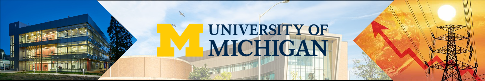

## Building-level electricity and HVAC demand prediction
Authors: Akash Mahajan, Van-Hai Bui

This GitHub repository contains code for building Bayesian Neural Network and Monte-Carlo LSTM (MC-LSTM)
for implemeting building-level energy demand prediction models for electricity and HVAC.

Our study focused on Building 59 [2], located inside the campus of Lawerence Berkeley
National Laboratory, for predicting electricity and HVAC demand for next 24 hours. In this study, 
thorough comparison of Probabilistic and Deterministic approach to prediction is performed.

**Project Structure:**
- `assets`: Images and other files (non-study, repository purposes only)
- `utils`: Contains code for data preprocessing, evaluation metrics, visualization, and neural network.

Note: We have used PyCharm Community Edition to write all program files.

----------
**Credits and References:**
1. [Abdulmajid-Murad @ GitHub, Probabilistic Deep Forecast](https://github.com/Abdulmajid-Murad/deep_probabilistic_forecast) (PyTorch implementation of BNN and MC-LSTM)
2. [Benchmark Datasets, Office of Energy Efficiency and Renewable Energy](https://bbd.labworks.org/ds/bbd/lbnlbldg59) (Dataset for Building 59)
3. All images in banner are protected by copyright and are referenced from khsswest.com and umich.edu